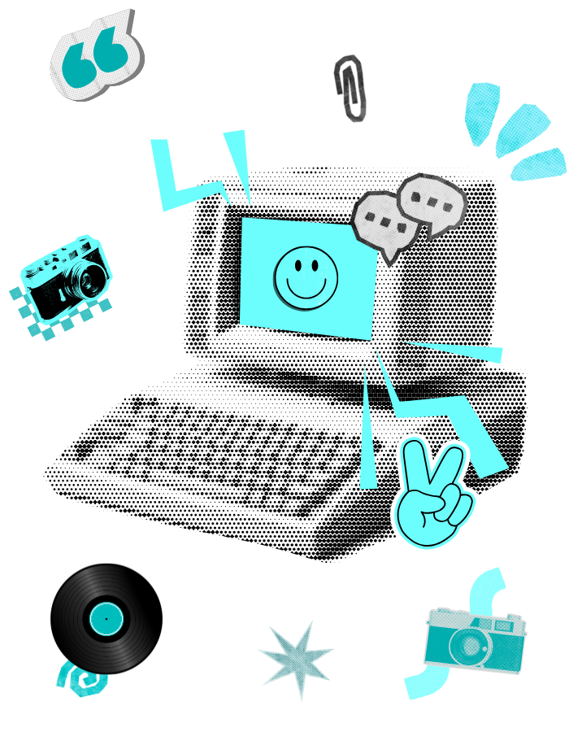

<table border="0">
 <tr>
  <td width="60%" valign="top">
    
   

    <strong>Hello! My name is Valber Lucas,</strong> Software Engineering. 
    I'm a Backend Developer, in process for FullStack.
   

   <blockquote>
    <i>"To Infinity and Beyond."</i> 💫
     
   </blockquote>

   <h3>🛠️ Technologies</h3>
   

    
    
    
     
    
    
    
     
    
    
    
   

   

   <h3>📡 Let's Talk!</h3>

  </td>
  
  <td width="70%" valign="center">
   

    
   

  </td>
 </tr>
</table>
